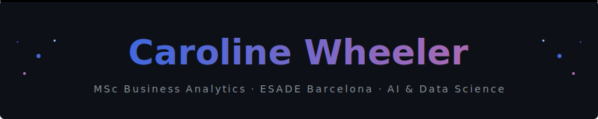

---

### 👋 About me

MSc Business Analytics at ESADE, with a focus on ML, NLP, and applied AI systems. Currently working with the **Hospital Clínic Barcelona**, one of the world's leading hepatic oncology centres, on a GenAI capstone research project backed by an AGAUR research-to-market grant. The brief: replace a slow, error-prone manual process for extracting structured data from free-text radiology reports with an AI extraction pipeline, validate it with clinical experts, and build toward a proof of concept that could lead to a research publication.

Outside of that: building things I find genuinely interesting; an F1 pit stop strategy engine, a computer vision fashion recommender, and whatever else seems worth making. The projects are on this page.

---

### 🛠 Stack

---

### 🚀 Featured Projects

<table>
<tr>
<td valign="top" width="50%">

#### 🏎️ F1 Pit Stop Strategy Engine
ML system predicting optimal pit window timing from real race data (2019–2024). Five-model ensemble comparing Random Forest vs Gradient Boosting across lap time degradation, pit duration, in/out lap performance and safety car probability — served via a 3D React dashboard with a live strategy visualiser.

`Python` · `scikit-learn` · `FastF1` · `React` · `Three.js`

</td>
<td valign="top" width="50%">

#### 🧵 Thread Trace
Computer Vision prototype that maps Pinterest mood board aesthetics onto a curated vector space of second-hand fashion listings using feature extraction and embedding similarity. Built for the PDAI course at ESADE.

`Python` · `Streamlit` · `Computer Vision` · `Embeddings`

[→ View repo](https://github.com/carolinewheeler333/thread-trace)

</td>
</tr>
</table>

---

### 🐍 Contributions

  

---

· · ·

